# CI/CD for `churn-analytics`

This document is the operator's guide to the GitHub Actions pipeline for
this dbt + Databricks project. It covers architecture, secrets, the
release process, rollback, cleanup, security controls, and known
limitations.

## 1. Architecture

```mermaid
flowchart LR
    A[Feature branch] --> B[Pull request]
    B --> C[Static checks<br/>yamllint / shellcheck /<br/>actionlint / dbt parse / sqlfluff]
    C --> D[dbt Slim CI<br/>state:modified+ --defer]
    D --> E[Isolated CI schemas<br/>ci_pr_&lt;PR&gt;_silver<br/>ci_pr_&lt;PR&gt;_gold]
    E --> F[Tests + artifacts]
    F --> G[Merge to main]
    G --> H[Production environment approval]
    H --> I[dbt parse / compile prod]
    I --> J[Databricks connectivity check]
    J --> K[Smoke test]
    K --> L[GitHub Release<br/>manifest.json + tag]
    L --> M[Databricks Workflow<br/>continues on its own schedule]
```



## 2. Responsibility split

| GitHub Actions                             | Databricks Workflow                     |
| ------------------------------------------ | --------------------------------------- |
| Pull-request validation                    | Bronze ingestion                         |
| Isolated dbt CI (Slim + fallback)          | Layer execution order                    |
| Tests and artifacts                        | Production dbt build                     |
| Approval + deployment                      | Retries and repair runs                  |
| Release traceability                       | Notifications                            |
| Code rollback via workflow_dispatch        | Operational monitoring                   |

GitHub Actions does **not** replace the scheduled Databricks Workflow.
The Workflow is the production runtime; GitHub Actions deploys the code
and publishes a versioned manifest that the Workflow (and Slim CI) can
reference.

## 3. Pull-request CI flow

Trigger: `pull_request` (opened / synchronize / reopened) on paths that
can affect dbt or Databricks behavior. Concurrency cancels stale CI runs
for the same PR.

Three jobs:

1. **static-checks** — always runs, including for forked PRs.
   - `actionlint`, `yamllint`, `shellcheck`, `python -m compileall`
   - `dbt deps`, `dbt parse` with placeholder credentials
   - SQLFluff on **changed SQL files only**, `continue-on-error: true`
     (non-blocking on the first month)

2. **dbt-ci** — only when `head.repo.full_name == github.repository`.
   - Uses the `ci` GitHub Environment
   - Bash safety guard (`scripts/ci/validate_environment.sh`) verifies
     `DBT_CI_SCHEMA_PREFIX ~= ^ci_pr_[0-9]+$` and that `DBT_CATALOG`
     equals `APPROVED_CI_CATALOG` (currently `workspace_ci`)
   - Attempts to fetch the latest `prod-*` GitHub Release and download
     `manifest.json`
   - Runs Slim CI when the manifest is available:
     `dbt build --select state:modified+ --defer --state prod-manifest
     --target ci --fail-fast`
   - Falls back to the `ci_build` selector (staging + intermediate +
     dims, no incremental facts) when no production release exists yet
   - Uploads artifacts: `manifest.json`, `run_results.json`,
     `catalog.json`, `sources.json`, `graph_summary.json`,
     `target/compiled/**`, `logs/dbt.log`
   - Writes a job summary with dbt version, invocation ID, commit,
     PR, catalog, prefix, and pass/fail/warn counts

3. **fork-notice** — only for forked PRs. Explains why the
   warehouse-touching job was skipped.

## 4. Slim CI, and the fallback

Slim CI needs a durable production manifest. GitHub Actions **artifacts
are not durable** (default 90-day retention, and only reachable through
API by workflow run ID). Instead, the `deploy-production` workflow
attaches every successful production build's `manifest.json` to a
**GitHub Release** tagged `prod-YYYYMMDD-HHMM-<shortsha>`. The CI job
pulls the most recent one via `gh release download`.

If no `prod-*` release exists yet (bootstrap), CI uses the `ci_build`
selector, which builds:

- all staging views
- all intermediate views
- all dimensions

… but not the incremental facts. This keeps the first CI run short and
avoids a full incremental rebuild on a fresh CI schema.

## 5. Isolated schema naming

Every PR CI run writes to two schemas inside the dedicated CI Unity
Catalog:

- `<APPROVED_CI_CATALOG>.ci_pr_<PR>_silver`
- `<APPROVED_CI_CATALOG>.ci_pr_<PR>_gold`

The mechanism is a small extension to `macros/generate_schema_name.sql`:
when `target.name == 'ci'` and `DBT_CI_SCHEMA_PREFIX` is non-empty, the
macro joins `<prefix>_<+schema>` (e.g. `ci_pr_123_silver`). For dev and
prod the branch is skipped and behavior is byte-identical to before.

Three layers of protection guarantee CI can never touch production
schemas:

1. **Macro-level** — prefixed only when `target.name == 'ci'` and the
   env var is set.
2. **Bash-level** — `scripts/ci/validate_environment.sh` fails the
   workflow if the prefix does not match the approved regex or the
   catalog is not `workspace_ci`.
3. **Unity-Catalog-level** — the CI service principal has grants only
   on `workspace_ci`; even a bypass at the previous two layers cannot
   write to `workspace.silver` / `workspace.gold`.

## 6. Production deployment flow

Trigger: `push` to `main` on the same paths as PR CI, or manual
`workflow_dispatch`. Concurrency `telecom-churn-production` prevents
overlapping deploys (`cancel-in-progress: false` — never kill a running
deploy).

Steps:

1. Checkout the exact commit
2. Install pinned Python deps and the Databricks CLI (via
   `databricks/setup-cli@main`)
3. Refuse to deploy if `DBT_CATALOG` looks like a CI catalog
4. `dbt deps` → `dbt parse --target prod` → `dbt compile --target prod`
5. `databricks current-user me` — confirms the prod service principal
   authenticates before we publish anything
6. Compute `prod-YYYYMMDD-HHMM-<shortsha>` tag
7. Upload artifacts (90-day retention on the workflow run)
8. Create a GitHub Release, attaching `manifest.json` and
   `run_results.json` — this is the **durable** artifact store used by
   Slim CI
9. Run smoke test (`dbt compile --selector smoke` +
   `dbt test --selector critical_tests` — non-destructive)
10. Optionally trigger the existing Databricks production Job (opt-in
    via `workflow_dispatch` input `trigger_production_job: true`)
11. Write a deployment summary

The workflow **does not** create, modify, or replace the scheduled
Databricks Workflow. That Workflow continues to run on its normal
schedule and picks up the deployed code at its next run.

## 7. Authentication

Databricks OAuth M2M via a service principal, using `client_id` +
`client_secret`. Two service principals are used:

| Purpose                | Grants                                                             |
| ---------------------- | ------------------------------------------------------------------ |
| **CI service principal**  | USE + CREATE + MODIFY on `workspace_ci` only; SELECT on any Bronze CI copy (or on `workspace.bronze` if you allow read-only access) |
| **Prod service principal**| SELECT on `workspace.bronze`; USE + CREATE + MODIFY on `workspace.silver` and `workspace.gold`; permission to run the production Job (`CAN MANAGE RUN`) |

Never commit tokens, client secrets, or a `profiles.yml` with baked
credentials. All targets in `profiles.yml` read credentials from env
vars only.

**Upgrade path — GitHub OIDC + Databricks WIF**: preferred long-term.
Requires configuring a workload-identity federation binding in the
Databricks account. Not enabled today; the workflows already declare
`id-token: write` so switching later is a config-only change.

## 8. GitHub Secrets and Variables

Configure these under **Settings → Environments** on the repository.

### Environment `ci`

| Kind     | Name                        | Example                                | Notes                                        |
| -------- | --------------------------- | -------------------------------------- | -------------------------------------------- |
| Variable | `DATABRICKS_HOST`           | `dbc-xxxx.cloud.databricks.com`        | no protocol                                  |
| Variable | `DBT_DATABRICKS_HTTP_PATH`  | `/sql/1.0/warehouses/<ci-warehouse>`   | CI SQL Warehouse                             |
| Variable | `DBT_CATALOG`               | `workspace_ci`                         | must differ from prod                        |
| Variable | `DBT_BRONZE_SCHEMA`         | `bronze`                               |                                              |
| Variable | `DBT_SILVER_SCHEMA`         | `silver`                               | joined with CI prefix at runtime             |
| Variable | `DBT_GOLD_SCHEMA`           | `gold`                                 | joined with CI prefix at runtime             |
| Variable | `APPROVED_CI_CATALOG`       | `workspace_ci`                         | belt-and-suspenders check                    |
| Variable | `APPROVED_CI_PREFIX_REGEX`  | `^ci_pr_[0-9]+$`                       | belt-and-suspenders check                    |
| Secret   | `DBT_DATABRICKS_CLIENT_ID`  | (CI SP client_id)                      |                                              |
| Secret   | `DBT_DATABRICKS_CLIENT_SECRET` | (CI SP client_secret)               |                                              |

### Environment `production`

Enable **Required reviewers** (yourself as a minimum) and restrict to
the `main` deployment branch.

| Kind     | Name                          | Example                                 | Notes                                        |
| -------- | ----------------------------- | --------------------------------------- | -------------------------------------------- |
| Variable | `DATABRICKS_HOST`             | `dbc-xxxx.cloud.databricks.com`         | no protocol                                  |
| Variable | `DBT_DATABRICKS_HTTP_PATH`    | `/sql/1.0/warehouses/<prod-warehouse>`  | prod SQL Warehouse                           |
| Variable | `DBT_CATALOG`                 | `workspace`                             |                                              |
| Variable | `DBT_BRONZE_SCHEMA`           | `bronze`                                |                                              |
| Variable | `DBT_SILVER_SCHEMA`           | `silver`                                |                                              |
| Variable | `DBT_GOLD_SCHEMA`             | `gold`                                  |                                              |
| Variable | `DATABRICKS_PROD_JOB_ID`      | `1234567890`                            | numeric Job ID; only read when `trigger_production_job` input is `true` |
| Secret   | `DBT_DATABRICKS_CLIENT_ID`    | (prod SP client_id)                     |                                              |
| Secret   | `DBT_DATABRICKS_CLIENT_SECRET`| (prod SP client_secret)                 |                                              |

### Repository variables (optional pins)

| Name                        | Example      |
| --------------------------- | ------------ |
| `PYTHON_VERSION`            | `3.12`       |
| `DBT_VERSION`               | `1.11.12`    |
| `DBT_DATABRICKS_VERSION`    | `1.12.2`     |

## 9. GitHub Environments

- `ci` — no protection.
- `production` — required reviewers, deployment branch policy = `main`,
  optional wait timer.

## 10. Release process

Every successful production deployment:

- Publishes a GitHub Release with tag `prod-YYYYMMDD-HHMM-<shortsha>`
- Attaches `manifest.json` and `run_results.json` as release assets
- Uploads workflow artifacts (90-day retention on the run)
- Writes a deployment summary with commit SHA, dbt invocation ID, and
  optional Databricks run ID

Slim CI on the next PR automatically defers to the newest `prod-*`
release.

## 11. Rollback process

**Code rollback is not data rollback.** Delta history exists for a
reason; do not delete or overwrite data during rollback unless you
explicitly need to.

To roll back deployed **code** to a prior release:

1. Actions → **Redeploy release** → **Run workflow**
2. Enter the tag (e.g. `prod-20260118-1520-abc1234`) or a commit SHA
3. Approve the `production` environment prompt
4. The workflow validates the ref, re-runs parse/compile against prod,
   runs the smoke test, and uploads artifacts

Leave `trigger_production_job = false` for a code-only rollback and let
the scheduled Databricks Workflow pick up the change on its next run.

For **data** issues:

- **Dimension mistake** — re-run the affected `dim_*` model via the
  Databricks Workflow (`--full-refresh` if necessary). Dims are small.
- **Fact mistake** — the two facts are Delta MERGE incrementals keyed
  on their surrogate. A corrected `dbt run` re-merges by unique_key.
  For a corrupted batch, prefer `--full-refresh` after confirming
  Bronze integrity.
- **Point-in-time restore** — use Delta history:
  `RESTORE TABLE ... TO TIMESTAMP AS OF ...`. This requires explicit
  approval and is out of scope for the automated pipeline.

## 12. Schema cleanup

Trigger: `pull_request: closed`. Runs the `Cleanup PR CI schema`
workflow, which uses the CI environment credentials and executes:

```
dbt run-operation drop_ci_schemas --target ci
```

`macros/ops/drop_ci_schemas.sql` and
`scripts/cleanup/drop_ci_schema.sh` validate:

- prefix matches `^ci_pr_[0-9]+$`
- prefix ends with the PR number
- resolved schemas are `ci_pr_<PR>_silver` and `ci_pr_<PR>_gold` only
- the catalog is `workspace_ci`

Then a scoped `DROP SCHEMA IF EXISTS <catalog>.<schema> CASCADE` runs
once per schema. Never uses wildcards, never `DROP CATALOG`.

If the CI service principal has no permission to drop schemas in
`workspace_ci`, the workflow will fail loudly; grant `DROP` on
`workspace_ci` to the CI SP or fall back to a scheduled cleanup notebook
on Databricks that reuses the same macro.

## 13. Artifact retention

| Artifact                            | Location                              | Retention             |
| ----------------------------------- | ------------------------------------- | --------------------- |
| CI dbt artifacts + docs             | GitHub Actions run                    | 14 days               |
| Production dbt artifacts            | GitHub Actions run                    | 90 days               |
| Production `manifest.json`          | GitHub Release asset                  | permanent (until you delete the tag) |
| Production `run_results.json`       | GitHub Release asset                  | permanent             |
| CI schemas                          | Databricks `workspace_ci`             | dropped on PR close   |

## 14. Troubleshooting

- **`dbt parse` fails in static-checks with "env_var required"** —
  a new env var was added to `profiles.yml` or a source YAML but the
  workflow does not set a placeholder. Add a default to the `env_var`
  call in the source YAML, or set a placeholder in
  `.github/workflows/dbt-pr-ci.yml`.
- **`validate_environment.sh` fails** — check that `APPROVED_CI_CATALOG`
  matches `DBT_CATALOG` on the `ci` environment.
- **Slim CI is not used** — check that a `prod-*` release exists
  (`gh release list`). The first bootstrap PR always uses the fallback
  selector.
- **Cleanup workflow doesn't drop the schema** — check the CI SP has
  `DROP` on the schema. Log line `Dropping CI schema ...` shows the
  target; if the log stops before the `run_query` call, one of the
  validations rejected the prefix.
- **Databricks CLI can't authenticate on deploy** — confirm the prod
  service principal secret and that `DATABRICKS_HOST` has no protocol.
- **Fork PR needs to run against Databricks** — a maintainer must push
  the branch to the same repo (or open a separate PR from a same-repo
  branch) so the CI credentials become available.

## 15. Known limitations

- **No Databricks Asset Bundle** — deliberately chosen (Path B). The
  production Databricks Workflow is managed manually in the UI. To move
  to bundle-based deployment, mirror the current Workflow into
  `resources/telecom_churn_workflow.yml`, add a
  `databricks bundle validate/deploy` step to `deploy-production.yml`,
  and remove `DATABRICKS_PROD_JOB_ID`.
- **OIDC not enabled** — using OAuth M2M client credentials. `id-token:
  write` is declared for a future switch to Databricks workload identity
  federation.
- **`dbt-core` is pinned to 1.11.12** transitively by
  `dbt-databricks==1.12.2`. Upgrading dbt-core is a separate change.
- **SQLFluff non-blocking initially** — flip `continue-on-error: false`
  and remove `sqlfluff lint ${CHANGED}` from the `continue-on-error`
  step after the first month of clean output.
- **First-run Slim CI unavailable** — until a `prod-*` release exists,
  CI falls back to the `ci_build` selector. Documented above.
- **Bronze in CI** — CI reads Bronze from `workspace.bronze` (read-only)
  or a CI Bronze copy, depending on the CI SP grants you configured.
  CI does not modify Bronze.

## 16. Cost controls

- Concurrency `dbt-pr-<PR>` cancels stale CI runs on push
- Slim CI limits scope to `state:modified+`, avoiding full rebuilds
- CI runs on a dedicated small SQL Warehouse (`DBT_DATABRICKS_HTTP_PATH`
  in the `ci` environment)
- Fork PRs skip Databricks entirely
- `fail-fast` short-circuits after the first failure
- CI schemas are dropped on PR close

## 17. Security controls

- Explicit `permissions:` block on every workflow (`contents: read` by
  default; elevated only where needed)
- Fork PRs cannot access CI credentials (job condition
  `head.repo.full_name == github.repository`)
- Placeholder credentials used in `static-checks` — real credentials
  never appear in that job
- All secrets sourced from GitHub Environment scoped secrets
- Bash strict mode (`set -euo pipefail`) in every script
- Every deployment tied to a specific commit SHA
- Every CI schema tied to a specific PR number
- CI service principal has no grants outside `workspace_ci`
- Prod service principal has no grants outside `workspace.{bronze,silver,gold}`

## Interviewer-ready explanation

> My GitHub Actions pipeline validates every pull request in an
> isolated schema — `ci_pr_<PR>_silver` and `ci_pr_<PR>_gold` inside a
> dedicated CI Unity Catalog — and blocks merge when dbt compilation,
> model execution, grain, reconciliation, or relationship tests fail.
> Slim CI defers to the manifest attached to the most recent production
> GitHub Release, so PR builds run only modified models plus their
> descendants. After approval and merge, GitHub Actions compiles the
> code against production, publishes a versioned release with the new
> manifest, and runs a non-destructive smoke test. Databricks Workflows
> remain responsible for ingestion, transformation order, retries,
> notifications, and operational run history — GitHub Actions never
> replaces the scheduled Workflow.

## Interview demonstration script

1. `git checkout -b demo/model-tweak`
2. Modify `models/silver/staging/stg_telecom_customer_churn.sql`
3. `git push -u origin demo/model-tweak` and open the pull request
4. Show the **Static checks** job passing (actionlint, yamllint,
   shellcheck, dbt parse, SQLFluff)
5. Show the **dbt CI** job resolving `ci_pr_<PR>_silver` /
   `ci_pr_<PR>_gold` in `validate_environment` step output
6. Show `state:modified+` selecting only the changed model and its
   downstream in the Slim CI step
7. Show tests + uploaded artifacts + the GitHub job summary
8. Introduce a deliberate failure: change `dim_customer.customer_key`
   to a non-unique expression, push
9. Show the CI job failing on the `not_null`/`unique` test
10. Revert the failing change and push
11. Show CI passing again
12. Merge to `main`
13. Show the **Deploy production** approval prompt
14. Show `dbt parse` / `dbt compile` succeeding against `prod`
15. Show the smoke test running `dbt test --selector critical_tests`
16. Show the new `prod-YYYYMMDD-HHMM-<sha>` GitHub Release with
    `manifest.json` attached
17. Show the deployment summary linking commit → dbt invocation ID →
    release → (optional) Databricks run ID
